# Get Started With GCP

## Make GCP Account
1. Make your GCP account with your Google account in https://console.cloud.google.com/ . You can get free trial account with limited credit and time.
2. After you registered, you can see this page 
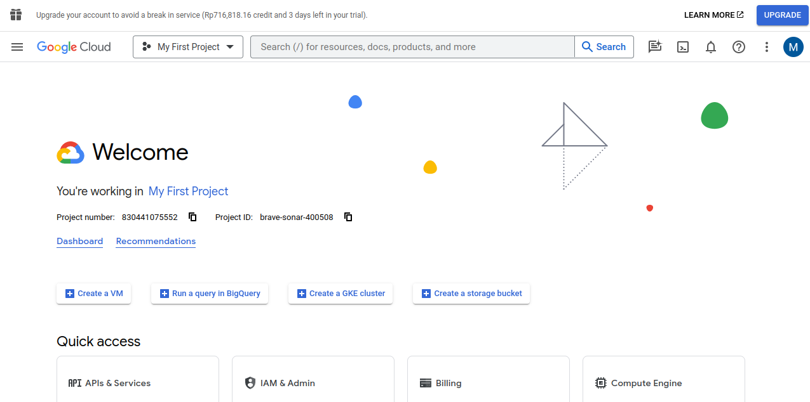
3. You can see your project and tools in GCP 
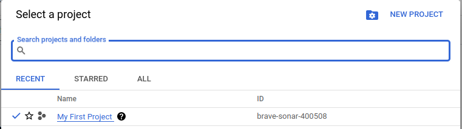 
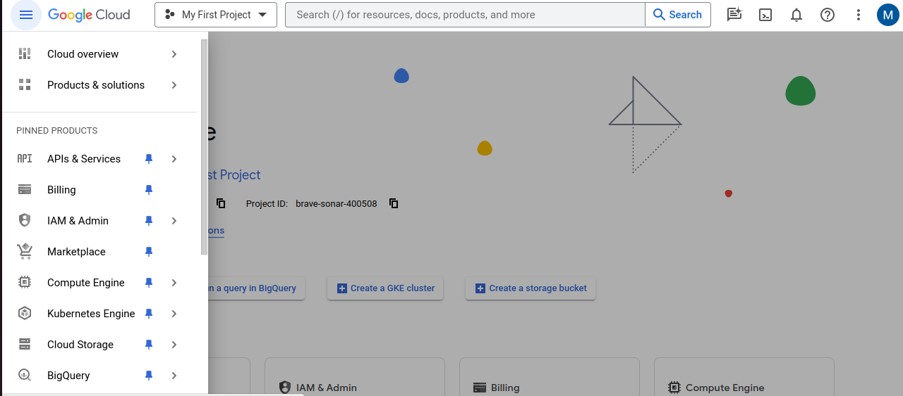

## Service Account
We need to make service account key to give acess for us to running terraform and dbt.
1. Choose IAM & Admin and select service account 
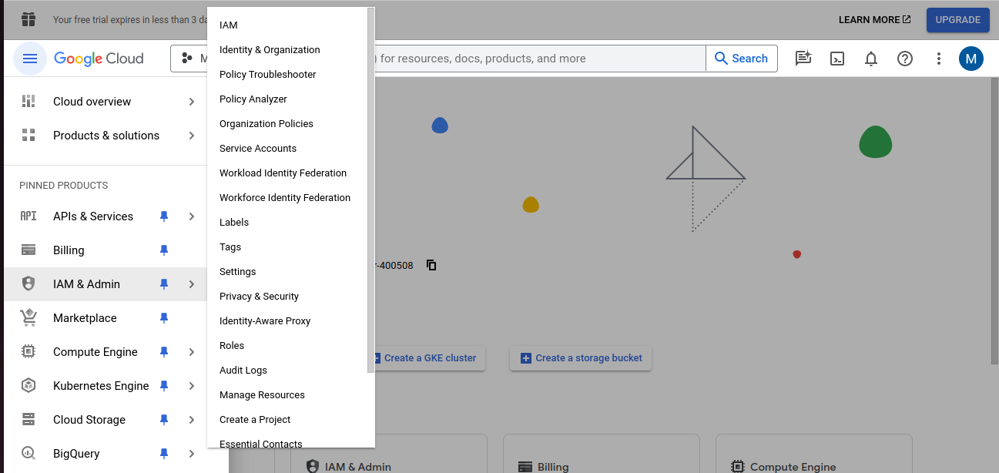
2. Select create service account 
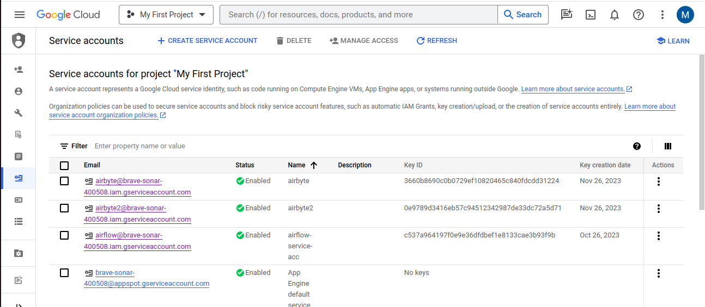
3. Fill with your service account name in first step 
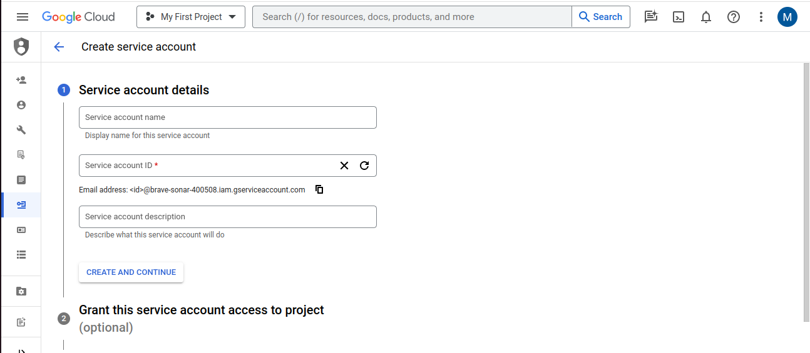
4. In second step choose "Basic" with roles "Owner". After that click Done 
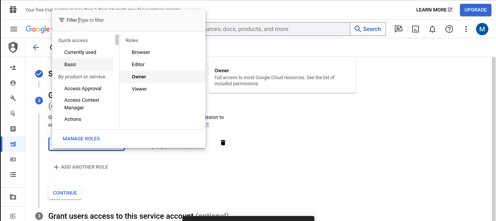
5. Service account will be created like this 
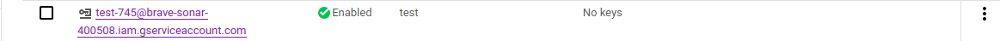
6. Click service account and choose "Keys" 
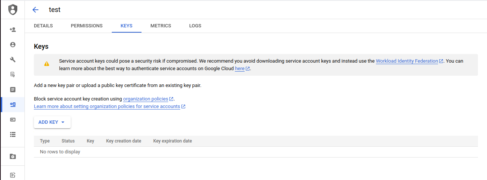
7. Click add key and then create new key 
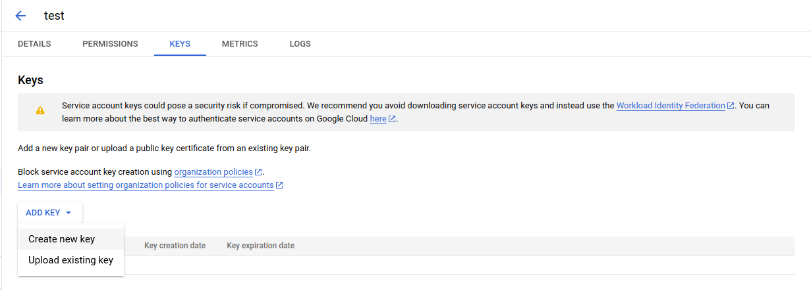
8. Choose JSON and click create 
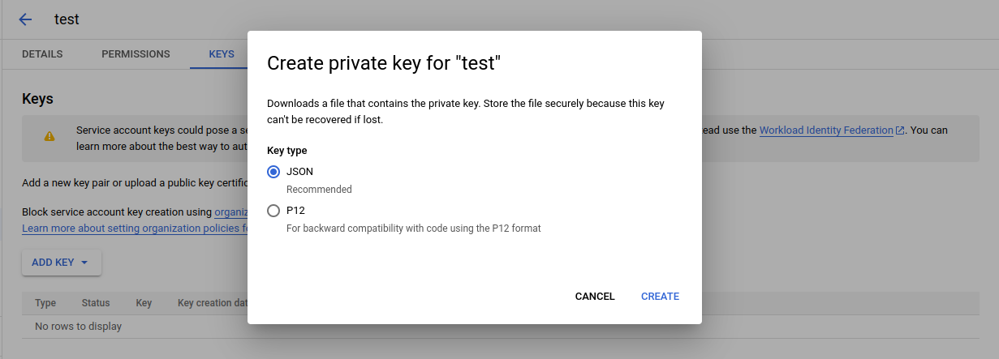
9. You can place and rename the json key file inside this folder project

## GCP Tools in Project
We use some tools in GCP to build this project

### Virtual Machine
All services in this project : producer, consumer, kafka and airflow is build with virtual machine  
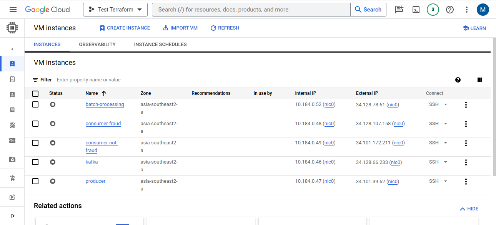

### Google Cloud Storage
Google Cloud Storage (GCS) as a data lake in this project  
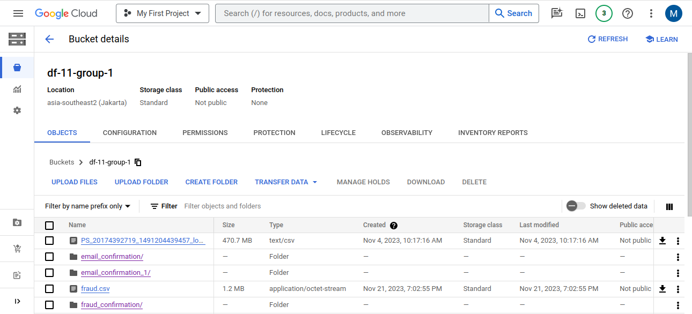

### BigQuery
BigQuery is place as a data warehouse to store all data with medalion architecture to serve in dashboard  
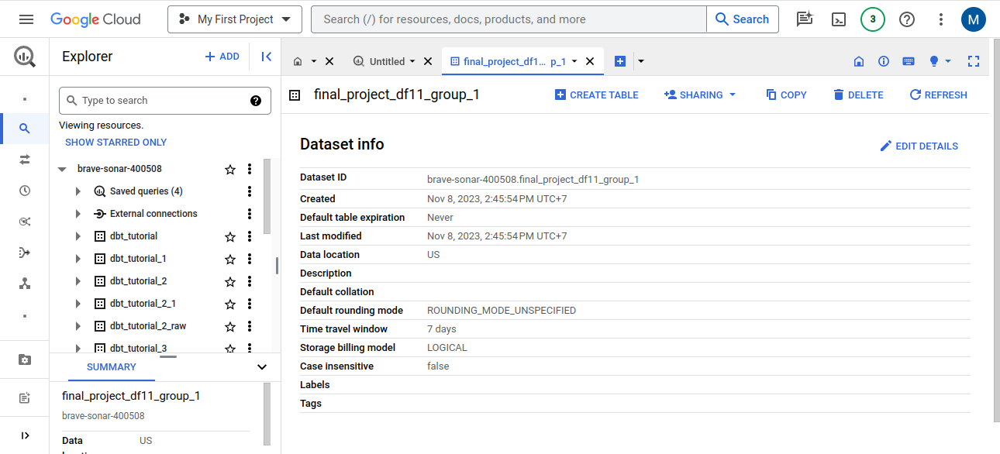

### Cloud Function
Cloud Function as a trigger for transfering result stream data from GCS to BigQuery  
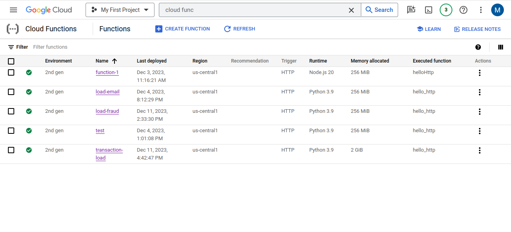